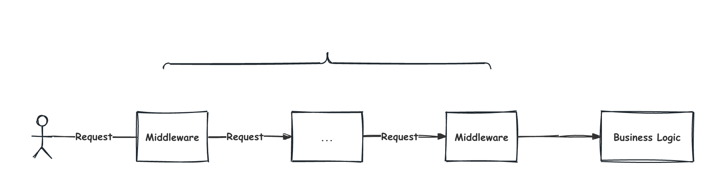

# Core Architecture: Middleware

> Understanding the "Onion Model" of our request processing pipeline.

## Background / Introduction
Middleware is code that executes between a request coming into a server and the final handler that generates the response. It allows for modularizing cross-cutting concerns.

## Core Concepts
- **Onion Model**: Requests pass through layers of middleware before reaching the core logic, and then responses pass back through the same layers in reverse order.
- **Next() Handler**: The mechanism by which one middleware passes control to the next one in the chain.

## Implementation / Usage
Middleware is commonly used for:
- Logging
- Error Recovery
- Authentication
- CORS Configuration

## Principle / Deep Dive
The layered approach ensures that concerns like security and logging are handled consistently for all routes:

### The Layered Approach:
- **Request Entry**: Every request enters through the outer layers (Logger, Recovery).
- **Processing**: It passes through security checks (CORS, Auth).
- **Business Logic**: Finally, it reaches the core handler.
- **Response**: The response travels back through the same layers.

## Pitfalls / Best Practices
- **Order Matters**: The order in which middleware is registered is the order in which it executes.
- **Keep it Focused**: Each piece of middleware should have a single responsibility.
